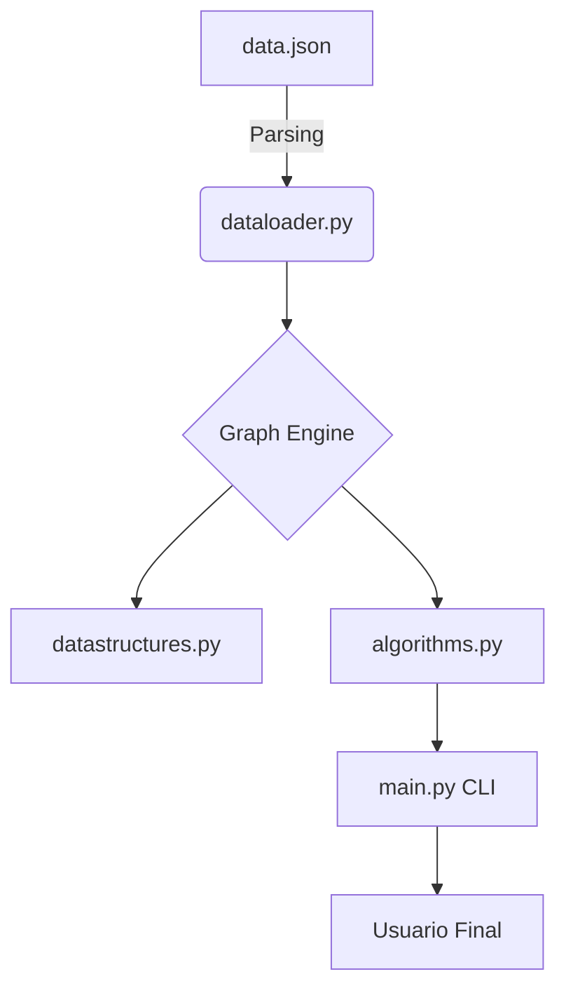
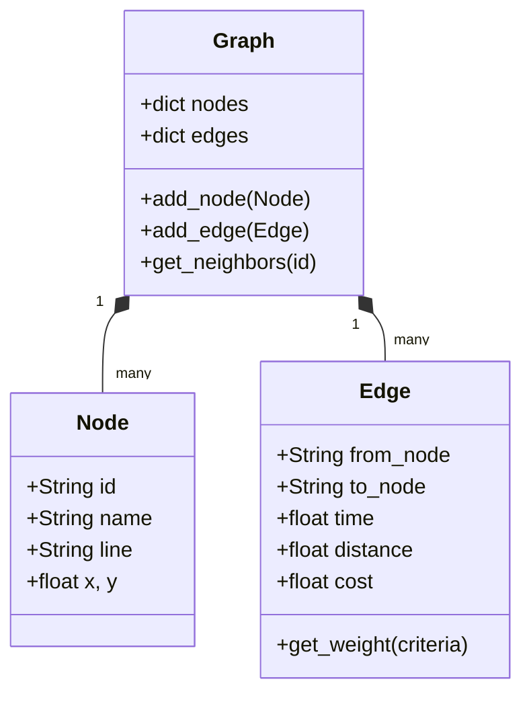

# MetroPath: Sistema de Planificación de Rutas de Transporte Público

**Estudiante:** Juliana Giraldo  
**Proyecto:** Core de Navegación de Transporte Urbano (Entregable 2)  
**Tecnologías:** Python, Grafos, Algoritmos de Optimización.

---

## 1. Objetivo del Proyecto
Desarrollar un sistema de navegación eficiente para redes de transporte público urbano que permita a los usuarios encontrar rutas óptimas basadas en diferentes criterios:
- **Tiempo:** Minimizar la duración del viaje.
- **Distancia:** Encontrar el recorrido físico más corto.
- **Costo:** Minimizar el gasto económico.
- **Transbordos:** Encontrar rutas con el mínimo número de cambios de línea (BFS).

---

## 2. Arquitectura General
El sistema sigue un diseño modular para separar la gestión de datos de la lógica algorítmica:



- **Módulo de Datos:** Archivo JSON que modela la red del Metro de Medellín.
- **Capa de Estructuras:** Implementación propia de Grafos mediante listas de adyacencia.
- **Motor Algorítmico:** Implementaciones optimizadas de Dijkstra, A* y BFS.
- **Interfaz (CLI):** Aplicación de consola para interacción y comparativa de rendimiento.

---

## 3. Modelado de Grafos
La red de transporte se modeló como un **Grafo Ponderado No Dirigido**.

- **Nodos (V):** Representan las estaciones. Cada nodo contiene:
    - Identificador único, nombre, línea y coordenadas geográficas (X, Y).
- **Aristas (E):** Representan las conexiones físicas entre estaciones. Cada arista posee pesos multivariables:
    - `time`: float (minutos)
    - `distance`: float (kilómetros)
    - `cost`: float (pesos colombianos)

**Estructura de Datos Principal:** Se utilizó una **Lista de Adyacencia** implementada con un diccionario de Python (`Hashtable`) para obtener una complejidad de búsqueda de vecinos de $O(1)$ en promedio.

---

## 4. Diagramas Técnicos

### Diagrama de Clases


---

## 5. Explicación de Algoritmos

### Dijkstra
Busca la ruta más corta expandiéndose uniformemente desde el origen. Utiliza una **Cola de Prioridad (Min-Heap)** para extraer siempre el nodo con la menor distancia acumulada, garantizando una complejidad de $O((V+E) \log V)$.

### A* (A-Star)
Mejora a Dijkstra incorporando una **función heurística** $f(n) = g(n) + h(n)$. 
- $g(n)$: Costo real acumulado.
- $h(n)$: Estimación al destino (Distancia Euclídea).
Esto permite que el algoritmo "ignore" estaciones que se alejan de la meta, reduciendo drásticamente los nodos visitados.

### BFS (Breadth-First Search)
Utilizado para la opción de "Mínimos Transbordos". Al no considerar pesos, encuentra la ruta con menos aristas entre dos puntos.

---

## 6. Evidencia de Código (Implementación Propia)

### Lógica del Algoritmo A*
```python
def a_star(graph, start_id, end_id, criteria):
    queue = []
    heapq.heappush(queue, (0, start_id))
    g_scores = {node_id: float('inf') for node_id in graph.get_all_nodes()}
    g_scores[start_id] = 0
    
    while queue:
        current_f, current_id = heapq.heappop(queue)
        if current_id == end_id: break
        
        for edge in graph.get_neighbors(current_id):
            weight = edge.get_weight(criteria)
            tentative_g = g_scores[current_id] + weight
            if tentative_g < g_scores[edge.to_node]:
                g_scores[edge.to_node] = tentative_g
                f_score = tentative_g + heuristic(neighbor, end_node)
                heapq.heappush(queue, (f_score, edge.to_node))
```

---

## 7. Conclusiones Técnicas
1. **Eficiencia Algorítmica:** A* demostró ser hasta un 30-40% más eficiente que Dijkstra en términos de nodos explorados cuando existe una heurística geográfica válida.
2. **Flexibilidad:** El modelado multivariable permite cambiar el criterio de optimización (tiempo/distancia/costo) sin modificar la estructura del grafo.
3. **Validación de Red:** El algoritmo de componentes conectados es vital para asegurar que la infraestructura cargada es funcional y no existen estaciones "huérfanas".
4. **Impacto de la Heurística:** En búsquedas por "Costo", A* se degrada a Dijkstra debido a la falta de una estimación monetaria basada en posición, evidenciando la importancia de elegir una heurística admisible.
